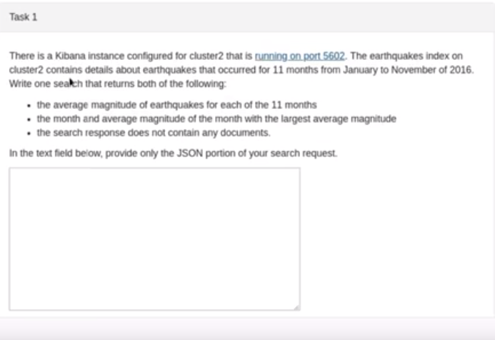

### 1、自定义分词插件，让king's和kings有相同的评分
https://elasticsearch.cn/article/13530

```
PUT my_index
{
  "settings": {
    "analysis": {
      "analyzer": {
        "my_custom_analyzer": {
          "type": "custom",
          "char_filter": [
            "emoticons"
          ],
          "tokenizer": "standard"
        }
      },
      "char_filter": {
        "emoticons": {
          "type": "mapping",
          "mappings": [
            "' => "
          ]
        }
      }
    }
  },
  "mappings": {
    "properties": {
      "title": {
        "type": "text",
        "analyzer": "my_custom_analyzer"
      }
    }
  }
}

POST my_index/_bulk
{"index":{"_id":1}}
{"title":"kings"}
{"index":{"_id":2}}
{"title":"king's"}

GET my_index/_search
{
  "query": {
    "match": {
      "title": "kings"
    }
  }
}

GET my_index/_search
{
  "query": {
    "match": {
      "title": "king's"
    }
  }
}


GET my_index/_analyze
{
  "text": "kings",
  "analyzer": "my_custom_analyzer"
}

GET my_index/_analyze
{
  "text": "king's",
  "analyzer": "my_custom_analyzer"
}
```

### 2、有一个文档，内容类似dog & cat， 要求索引这条文档，并且使用match_phrase query，查询dog & cat或者dog and cat都能match。

https://elasticsearch.cn/article/6133

```
DELETE whitespace_example
PUT /whitespace_example
{
  "settings": {
    "analysis": {
      "analyzer": {
        "rebuilt_whitespace": {
          "tokenizer": "whitespace",
           "char_filter": [
            "my_char_filter"
          ]
        }
      },
        "char_filter": {
        "my_char_filter": {
          "type": "mapping",
          "mappings": [
            "& => and"
          ]
        }
      }
    }
  },
  "mappings": {
    "properties": {
      "title":{
        "type":"text",
        "analyzer": "rebuilt_whitespace"
      }
    }
  }
}

POST whitespace_example/_bulk
{"index":{"_id":1}}
{"title":"dog & cat"}
{"index":{"_id":2}}
{"title":"dog and cat"}

POST whitespace_example/_msearch
{}
{"query":{"match_phrase":{"title":"dog & cat"}}}
{}
{"query":{"match_phrase":{"title":"dog and cat"}}}
```

#### 2.1 方法2解读
```
PUT /test_index009
{
  "settings": {
    "index": {
      "analysis": {
        "analyzer": {
          "synonym": {
            "tokenizer": "whitespace",
            "filter": [
              "synonym"
            ]
          }
        },
        "filter": {
          "synonym": {
            "type": "synonym",
            "lenient": true,
            "synonyms": [
              "& => and"
            ]
          }
        }
      }
    }
  },
  "mappings": {
    "properties": {
      "title":{
        "type":"text",
        "analyzer": "synonym"
      }
    }
  }
}

POST test_index009/_bulk
{"index":{"_id":1}}
{"title":"dog & cat"}
{"index":{"_id":2}}
{"title":"dog and cat"}

POST test_index009/_search
{
  "query": {
    "match_phrase": {
      "title": "dog & cat"
    }
  }
}

POST test_index009/_search
{
  "query": {
    "match_phrase": {
      "title": "dog and cat"
    }
  }
}

GET test_index009/_analyze
{
  "field": "title",
  "text": ["dog & cat", "dog and cat"]
}
```
### 3、问题1，问题2小结
#### Simple Analyzer – 按照非字母切分（符号被过滤），小写处理
#### Stop Analyzer – 小写处理，停用词过滤（the，a，is）
#### Whitespace Analyzer – 按照空格切分，不转小写
#### Keyword Analyzer – 不分词，直接将输入当作输出
#### Patter Analyzer – 正则表达式，默认 \W+ (非字符分隔)
#### Language – 提供了30多种常见语言的分词器


### 4、聚合实现


==
```
PUT  earthquakes
{
  "mappings":{
    "properties":{
      "magnitude":{
        "type":"long"
      }
    }
  }
}

POST /earthquakes/_search
{
  "size": 0,
  "aggs": {
    "mag_over_time": {
      "date_histogram": {
        "field": "date",
        "calendar_interval": "month"
      },
      "aggs": {
        "avg_mags": {
          "avg": {
            "field": "magnitude.keyword"
          }
        }
      }
    },
    "max_mag_of_month": {
      "max_bucket": {
        "buckets_path": "mag_over_time>avg_mags"
      }
    }
  }
}
```

### 4、管道实现

==
```
PUT _ingest/pipeline/earthquakes_pipeline
{
  "processors" : [
   {
  "uppercase": {
    "field": "magnitude"
  }
},   {
        "script": {
             "lang": "painless",
          "source": """
           if (ctx.containsKey("batch_num") == true) {ctx.batch_num +=1}else {ctx.batch_num =1}
          """
        }
      }
  ]
}


PUT earthquakes
POST earthquakes/_doc/1
{
  "cont":"1111",
  "magnitude":"asdf"
}

POST earthquakes/_update_by_query?pipeline=earthquakes_pipeline
{
  "query":{
    "match_all":{}
  }
}

GET earthquakes/_search
```

### 4、查询实现

==
```
POST movies/_search
{
  "query": {
    "bool": {
      "must": [
        {
          "match_phrase": {
            "overview": "new york"
          }
        }
      ],
      "should": [
        {
          "match_phrase": {
            "title": "new york"
          }
        },
        {
          "match_phrase": {
            "tags": "new york"
          }
        },
        {
          "match_phrase": {
            "tagline": "new york"
          }
        }
      ],
      "minimum_should_match" : 1
    }
  }
}
```
https://github.com/linuxacademy/content-elastic-certified-engineer/tree/master/sample_data


### 5、有index_a包含一些文档， 要求创建索引index_b，通过reindex api将index_a的文档索引到index_b。
要求增加一个整形字段，value是index_a的field_x的字符长度； 再增加一个数组类型的字段，value是field_y的词集合。

(field_y是空格分割的一组词，比方"foo bar"，索引到index_b后，要求变成["foo", "bar"]。

```
PUT index_a
{
  "mappings": {
    "properties": {
      "title":{
        "type":"keyword"
      }
    }
  }
}


POST index_a/_bulk
{"index":{"_id":1}}
{"title":"foo bar"}

PUT _ingest/pipeline/a_pipeline
{
  "processors": [
    {
      "script": {
        "source": "ctx.length = ctx.title.length();"
      }
    },
    {
      "split": {
        "field": "title",
        "separator": " "
      }
    }
  ]
}


PUT index_b
{
  "mappings": {
    "properties": {
      "title":{
        "type":"keyword"
      }
    }
  }
}

POST _reindex
{
  "source": {
    "index": "index_a"
  },
  "dest": {
    "index": "index_b",
    "pipeline": "a_pipeline"
  }
}

GET index_b/_search
```
