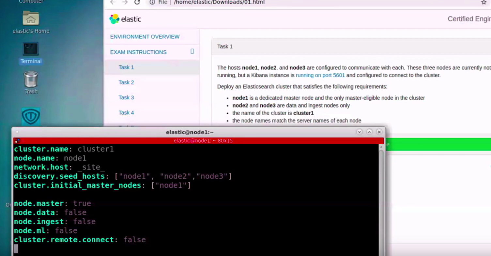
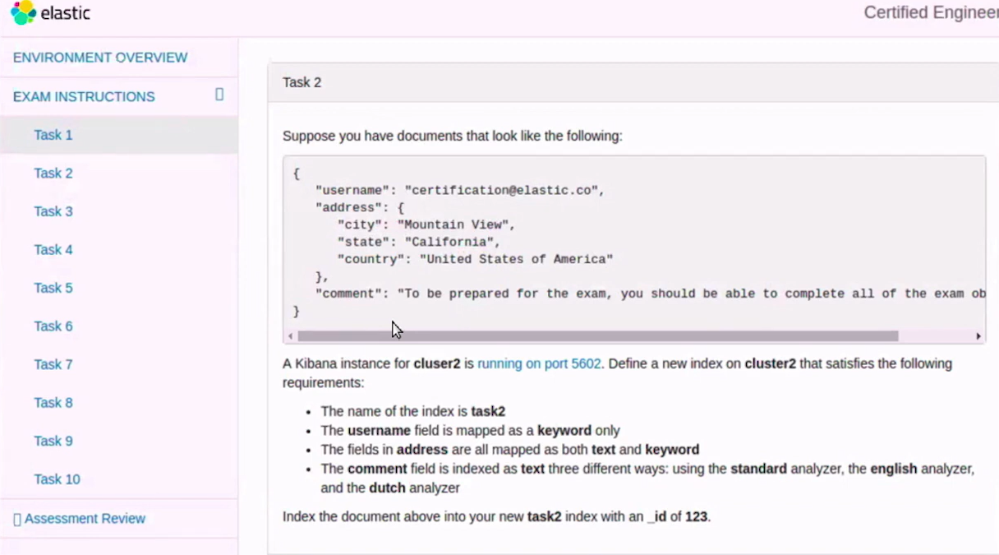
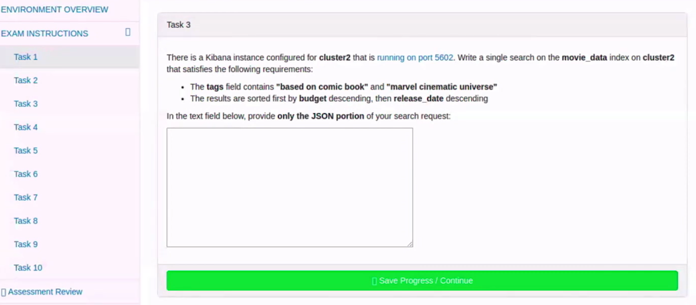

### 0、真题来源

https://www.elastic.co/cn/training/certification/faq

### 1、部署实战题


==

==
```
PUT  earthquakes
{
  "mappings":{
    "properties":{
      "magnitude":{
        "type":"long"
      }
    }
  }
}

POST /earthquakes/_search
{
  "size": 0,
  "aggs": {
    "mag_over_time": {
      "date_histogram": {
        "field": "date",
        "calendar_interval": "month"
      },
      "aggs": {
        "avg_mags": {
          "avg": {
            "field": "magnitude.keyword"
          }
        }
      }
    },
    "max_mag_of_month": {
      "max_bucket": {
        "buckets_path": "mag_over_time>avg_mags"
      }
    }
  }
}
```

### 2、Mapping定义实战题

==
```
PUT _ingest/pipeline/earthquakes_pipeline
{
  "processors" : [
   {
  "uppercase": {
    "field": "magnitude"
  }
},   {
        "script": {
             "lang": "painless",
          "source": """
           if (ctx.containsKey("batch_num") == true) {ctx.batch_num +=1}else {ctx.batch_num =1}
          """
        }
      }
  ]
}


PUT earthquakes
POST earthquakes/_doc/1
{
  "cont":"1111",
  "magnitude":"asdf"
}

POST earthquakes/_update_by_query?pipeline=earthquakes_pipeline
{
  "query":{
    "match_all":{}
  }
}

GET earthquakes/_search
```

### 4、查询实战题

==
```
POST movies/_search
{
  "query": {
    "bool": {
      "must": [
        {
          "match_phrase": {
            "overview": "new york"
          }
        }
      ],
      "should": [
        {
          "match_phrase": {
            "title": "new york"
          }
        },
        {
          "match_phrase": {
            "tags": "new york"
          }
        },
        {
          "match_phrase": {
            "tagline": "new york"
          }
        }
      ],
      "minimum_should_match" : 1
    }
  }
}
```

